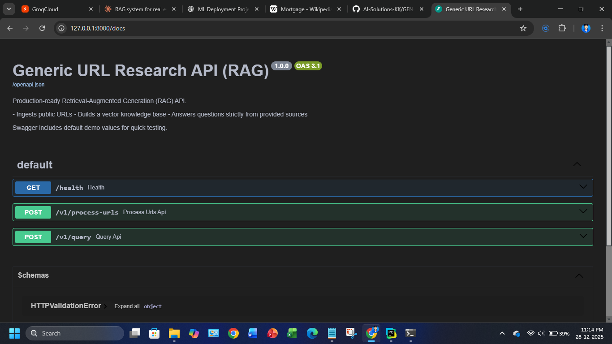
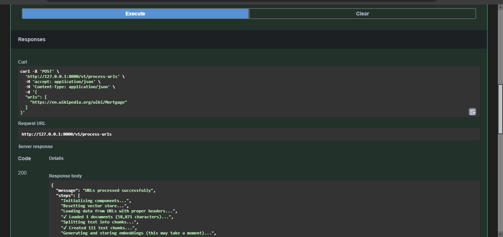
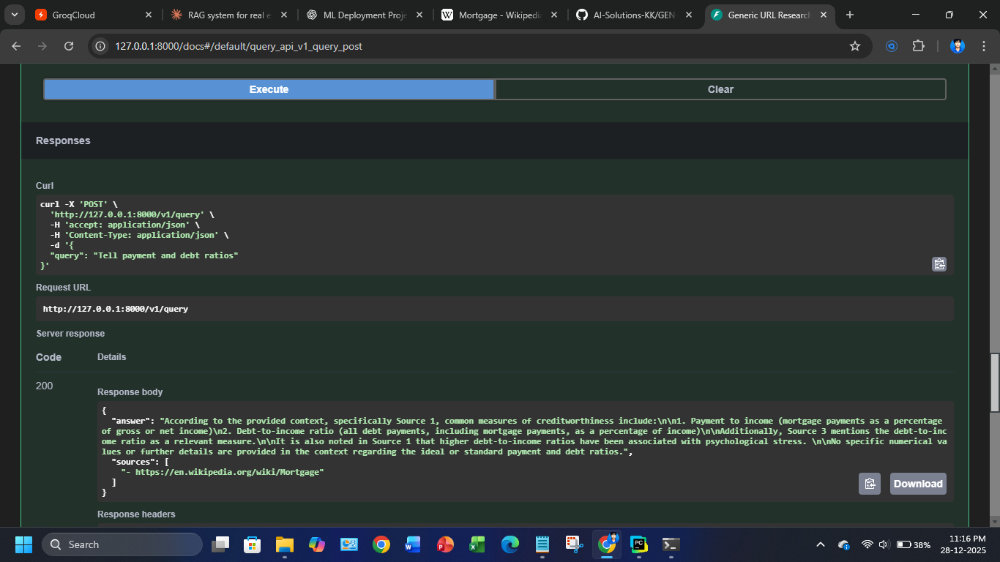
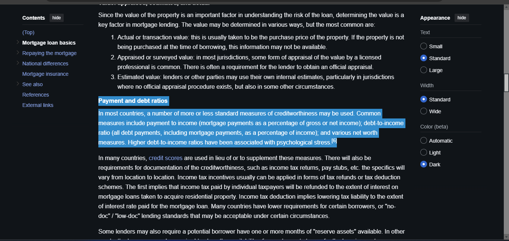

# GenAI Research API

A production-grade Retrieval-Augmented Generation (RAG) API that enables intelligent question-answering from any public web content. Built with FastAPI, LangChain, and ChromaDB.

---
## Project Snap shots





## Overview
This API accepts one or more public URLs, processes their content into a searchable knowledge base, and provides accurate, citation-backed answers to user queries. All responses are strictly grounded in the ingested content, preventing hallucinations and ensuring factual accuracy.

**Key Use Cases:**
- Automated research from multiple web sources
- Document Q&A systems
- Knowledge base creation from public content
- Fact-checking and information verification

## Architecture

### System Components

**Data Ingestion Pipeline:**
1. URL content fetching with proper web scraping protocols
2. Text extraction and cleaning
3. Semantic chunking with overlap for context preservation
4. Embedding generation using HuggingFace transformers
5. Vector storage in persistent ChromaDB instance

**Query Pipeline:**
1. User query embedding generation
2. Similarity search across vector store
3. Context retrieval with relevance scoring
4. LLM-based answer generation with prompt engineering
5. Source citation extraction and formatting

**Technology Stack:**
- **API Framework:** FastAPI with automatic OpenAPI documentation
- **LLM Provider:** Groq (LLaMA 3.3 70B)
- **Embeddings:** sentence-transformers/all-MiniLM-L6-v2
- **Vector Database:** ChromaDB with persistent storage
- **Orchestration:** LangChain for RAG pipeline management

## API Endpoints

### Health Check
```
GET /health
```
Returns API status and readiness.

### Process URLs
```
POST /v1/process-urls
```
Ingests content from provided URLs into the vector database.

**Request Body:**
```json
{
  "urls": [
    "https://example.com/article-1",
    "https://example.com/article-2"
  ]
}
```

**Response:**
```json
{
  "message": "URLs processed successfully",
  "status": "Vector store ready with 47 chunks stored"
}
```

### Query Knowledge Base
```
POST /v1/query
```
Retrieves and answers questions based on ingested content.

**Request Body:**
```json
{
  "query": "What are the main points discussed in the articles?"
}
```

**Response:**
```json
{
  "answer": "Based on the provided sources, the main points include...",
  "sources": "- https://example.com/article-1\n- https://example.com/article-2"
}
```

## Installation

### Prerequisites
- Python 3.10 or higher
- pip package manager
- Valid Groq API key

### Setup Instructions

1. Clone the repository:
```bash
git clone <repository-url>
cd real-estate-research-api
```

2. Create and activate virtual environment:
```bash
python -m venv venv
source venv/bin/activate  # On Windows: venv\Scripts\activate
```

3. Install dependencies:
```bash
pip install -r requirements.txt
```

4. Configure environment variables:
```bash
# Create .env file
echo "GROQ_API_KEY=your_api_key_here" > .env
```

5. Run the API server:
```bash
uvicorn main:app --host 0.0.0.0 --port 8000 --reload
```

6. Access Swagger UI:
```
http://localhost:8000/docs
```

## Configuration

### Environment Variables

| Variable | Description | Required |
|----------|-------------|----------|
| `GROQ_API_KEY` | API key for Groq LLM service | Yes |

### Model Parameters

Configurable in `rag.py`:
- `CHUNK_SIZE`: Text chunk size (default: 800 characters)
- `CHUNK_OVERLAP`: Overlap between chunks (default: 150 characters)
- `EMBEDDING_MODEL`: HuggingFace model identifier
- `VECTORSTORE_DIR`: Persistent storage location

## Usage Examples

### Using Swagger UI

1. Navigate to `http://localhost:8000/docs`
2. Expand the `/v1/process-urls` endpoint
3. Click "Try it out"
4. Enter URLs in the request body
5. Execute and verify successful ingestion
6. Use `/v1/query` endpoint to ask questions

### Using cURL

**Process URLs:**
```bash
curl -X POST "http://localhost:8000/v1/process-urls" \
  -H "Content-Type: application/json" \
  -d '{
    "urls": [
      "https://en.wikipedia.org/wiki/Artificial_intelligence"
    ]
  }'
```

**Query Knowledge Base:**
```bash
curl -X POST "http://localhost:8000/v1/query" \
  -H "Content-Type: application/json" \
  -d '{
    "query": "What is artificial intelligence?"
  }'
```

### Using Python Requests

```python
import requests

# Process URLs
response = requests.post(
    "http://localhost:8000/v1/process-urls",
    json={"urls": ["https://example.com/article"]}
)
print(response.json())

# Query
response = requests.post(
    "http://localhost:8000/v1/query",
    json={"query": "What is the main topic?"}
)
print(response.json())
```

## Project Structure

```
.
├── main.py                 # FastAPI application and routes
├── rag.py                  # RAG pipeline implementation
├── requirements.txt        # Python dependencies
├── .env                    # Environment variables (not in git)
├── .gitignore             # Git exclusions
├── resources/
│   └── vectorstore/       # Persistent ChromaDB storage
└── README.md              # This file
```

## Deployment

### Docker Deployment

Create `Dockerfile`:
```dockerfile
FROM python:3.10-slim
WORKDIR /app
COPY requirements.txt .
RUN pip install --no-cache-dir -r requirements.txt
COPY . .
EXPOSE 8000
CMD ["uvicorn", "main:app", "--host", "0.0.0.0", "--port", "8000"]
```

Build and run:
```bash
docker build -t genai-research-api .
docker run -p 8000:8000 --env-file .env genai-research-api
```

### Cloud Deployment

Compatible with:
- AWS ECS/Fargate with Application Load Balancer
- Azure Container Instances with API Management
- Google Cloud Run with Cloud Endpoints
- Kubernetes clusters with ingress controllers

**Requirements:**
- Persistent volume for vector store
- Environment variable injection for API keys
- HTTPS/TLS termination at load balancer

## Limitations

- **URL Accessibility:** Only processes publicly accessible URLs
- **Content Types:** Optimized for text-based HTML content
- **Rate Limits:** Subject to Groq API rate limits and quotas
- **Vector Store:** Single-tenant design; multi-user deployments require isolation strategy
- **Memory:** Embedding generation requires sufficient RAM for model loading
- **Context Window:** LLM responses limited by model's maximum token context

## Security Considerations

- API keys stored in environment variables, never committed to version control
- No authentication layer included; implement API gateway for production
- Input validation prevents injection attacks
- Vector store isolation prevents cross-tenant data leakage
- Safe prompt design mitigates prompt injection risks

## Future Enhancements

- Multi-user support with isolated vector stores per user/tenant
- Support for additional document formats (PDF, DOCX, etc.)
- Streaming responses for real-time answer generation
- Caching layer for frequently asked questions
- Rate limiting and API key authentication
- Batch URL processing with async operations
- Advanced chunking strategies (semantic, sliding window)
- Support for multiple LLM providers
- Monitoring and observability with metrics/logging
- Automated testing suite with integration tests

## License

This project is provided as-is for demonstration and development purposes. For production use, ensure compliance with:
- Groq API Terms of Service
- HuggingFace Model Licenses
- Web scraping policies of target websites
- Applicable data privacy regulations (GDPR, CCPA, etc.)

## Support

For issues, feature requests, or contributions, please contact the development team or create an issue in the project repository.

---

**Version:** 1.0.0  
**Last Updated:** December 2025  
**Maintainer:** AI Solution Team

**Author** Karan KK